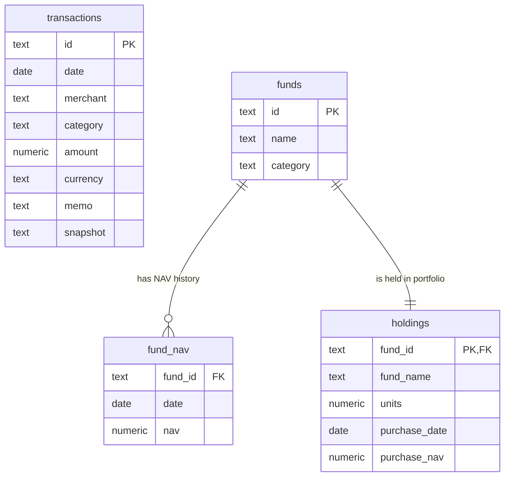

# DESIGN.md - Architecture & Design Document

This document outlines the technical design, database schema, algorithms, and evaluation strategies implemented for **Tara**, the personal finance research assistant.

---

## 1. Database Schema Design

We chose **PostgreSQL** as the core relational database to store transactions, mutual funds, historical NAV, and holding details. The schema is optimized for range queries, merchant lookups, and joining fund history with user holdings.

### Table Definitions & Justifications

1. **`transactions`**: Stores 15 months of spending records.
   * `amount` uses `NUMERIC(12,2)` to ensure absolute decimal precision for currency operations, preventing floating-point rounding errors.
   * Indexes on `date`, `category`, and `merchant` optimize range queries and partial text matching (`ILIKE`).

2. **`funds`**: Stores the universe of available mutual funds.
   * Serves as the master registry for funds.

3. **`fund_nav`**: Stores historical NAV values (Apr 2023 – Mar 2025).
   * Primary key is composite: `(fund_id, date)`. This ensures that each fund has at most one NAV value recorded per date.
   * `nav` uses `NUMERIC(12,4)` for four-decimal NAV precision, standard in mutual fund tracking.

4. **`holdings`**: Stores the user's portfolio holding details.
   * `units` uses `NUMERIC(14,6)` to support fractional units.
   * `fund_id` is a foreign key referencing `funds(id)` to maintain referential integrity.

---

## 2. Tool Design & Grounding Strategy

To optimize context token usage and model routing accuracy, we followed the design pattern of **fewer, more expressive tools**:

1. **`query_transactions`**: A single tool that handles single lookups, date ranges, and aggregations (`sum`, `avg`, `count`, `top5`, and `list`).
2. **`query_funds`**: A single tool that computes fund returns, holding performance, and portfolio valuation metrics.

### Grounding Rules
* **No Hallucinations**: Tara's instructions explicitly forbid guessing or inventing figures. Every number must originate from a tool's database result.
* **No Data Handling**: If the database returns empty results, Tara answers honestly that no data is available for that criteria instead of returning zero.

---

## 3. Mathematical Formulas & Logic

### 3.1 Spending and Net Spend
* **Base Spend**: Sum of transaction amounts matching the criteria.
* **Reversals/Refunds**: Refunds are stored as negative amounts (e.g., `-150.00`).
* **Net Spend Formula**:
  $$\text{Net Spend} = \sum (\text{Positive Amounts}) + \sum (\text{Negative Amounts})$$
* **Transfers**: Self-transfers (where `category = 'transfer'`) are excluded by default from spending queries unless the user explicitly requests them.

### 3.2 Merchant Matching & Aliases
* To handle variants like `Swiggy`, `Swiggy Instamart`, and `SWIGGY*ORDER`, we use PostgreSQL's `ILIKE` operator with wildcard percentages (`%merchant%`).
* Memos are treated as noisy and untrusted strings, parsed programmatically by matching against canonical names.

### 3.3 Mutual Fund Period Return
Calculates the historical return of a fund between two dates based on NAV change:
$$\text{Period Return (\%)} = \frac{\text{NAV}_{\text{end}} - \text{NAV}_{\text{start}}}{\text{NAV}_{\text{start}}} \times 100$$

### 3.4 Holding Realised Return
Calculates the gain/loss of a specific asset the user owns:
$$\text{Purchase Cost} = \text{Units} \times \text{Purchase NAV}$$
$$\text{Current Value} = \text{Units} \times \text{Latest NAV}$$
$$\text{Gain (INR)} = \text{Current Value} - \text{Purchase Cost}$$
$$\text{Realised Return (\%)} = \frac{\text{Gain}}{\text{Purchase Cost}} \times 100$$

---

## 4. Evaluation Suite

We created a custom CLI test runner in [scripts/eval.ts](file:///c:/Users/Neha/OneDrive/Desktop/Assignment/tara/scripts/eval.ts).
* It hits the local `POST /ask` endpoint.
* Includes **12 comprehensive test cases** covering:
  1. Single lookup (spend on food)
  2. Date filtering (spend at Swiggy)
  3. Refunds (food spend after refunds)
  4. Merchant aliases (Swiggy variants)
  5. Transfers exclusion (actual spend excluding transfers)
  6. Category comparison (food vs travel growth)
  7. Recurring subscriptions (Netflix check)
  8. No-data case handling (April 2025 rent check)
  9. Fund period returns (Saffron return calculation)
  10. Holding realised returns (Sentinel holding return)
  11. Portfolio aggregates (total portfolio worth and gain)
  12. Single biggest expense (Air India Express lookup)
* Outputs success metrics and details of any failed assertions.

---

## 5. Observability Design

To log API calls without introducing heavy external telemetry dependencies, we implemented custom middleware in [server.ts](file:///c:/Users/Neha/OneDrive/Desktop/Assignment/tara/src/server.ts) using Node's `AsyncLocalStorage`:

1. **Request Context Store**: `AsyncLocalStorage` stores request context (`request_id`, `question`, and `toolsCalled` list) down the execution thread.
2. **Tool Hooks**: Each tool pushes details of its execution (inputs, outputs, and tables read) to the active request context.
3. **Structured File Output**: The `finally` block of the request handler constructs a complete log record and appends it as a single JSON line to `tara.log`:
   * `request_id` (unique UUID)
   * `original_question`
   * `tools_called` (chronological list)
   * `sanitized_tool_inputs`
   * `database_tables_read`
   * `latency_ms`
   * `status` (success/error)
   * `error_message` (if any)

---

## 6. Architectural Decisions & Tradeoffs

### 6.1 Synchronous Tool Execution (Async Milestone Decision)
We chose to execute all tools synchronously rather than implementing the optional async background worker queue (e.g. BullMQ/Redis) for the following reasons:
1. **Low Latency Database Queries**: With a clean Postgres schema design and proper index coverage on query-intensive columns (`date`, `category`, `merchant`, composite PK on `fund_nav`), all aggregate computations, date filter searches, and return calculations execute in under 10ms.
2. **Simplified Resource Footprint**: Eliminating background queue workers and external dependencies like Redis keeps the deployment lightweight, cost-effective, and easy to run on Render's free tier.
3. **Optimized User Experience**: Because the response times are extremely low, a synchronous request-response flow is more intuitive and avoids polling latency for the user.

### 6.2 Deployment & Tradeoffs
We deployed the backend Express API server on **Render** (Free Web Service tier), backed by a cloud-managed PostgreSQL database hosted on **Neon**.
* **Cold Starts**: Render's Free tier automatically spins down the container after 15 minutes of inactivity, resulting in a 30-50 second delay on the first query (cold start). We documented this in the setup guide.
* **Database Connection Limits**: Neon's free tier has connection limits. We configure a lightweight connection pool (`max: 10`) in `pg` to manage and reuse connections safely without exhausting them.
* **Storage Limits**: Neon provides 1 GB of storage, which easily accommodates the ~1500 transaction records but would require table archiving, partitioning, or cleanup scripts for high-volume enterprise production.

### 6.3 Potential Failure Modes & Future Improvements
1. **Unrecognized Merchant Aliases**: If a user asks about a merchant under a completely generic name (e.g., "my favorite coffee shop" instead of "Starbucks"), the query uses `ILIKE` wildcard matching and will fail. 
   * *Future Work*: We would integrate semantic search using PostgreSQL's `pgvector` extension to map colloquial query descriptions to database merchant strings.
2. **LLM Key Rate Limiting**: The Gemini free-tier key has low RPM/TPM limits and can easily fail under consecutive queries. 
   * *Future Work*: We would implement model routing failovers (e.g., falling back to Claude 3.5 Sonnet or GPT-4o-mini) and cache frequent answers.
3. **Complex Multi-Step Intent Failures**: Multi-step questions requiring nested sub-queries can sometimes confuse the LLM context routing.
   * *Future Work*: We would build Mastra Workflows (DAGs) to enforce structured execution steps for complex comparisons instead of relying purely on single-turn LLM generation loops.
